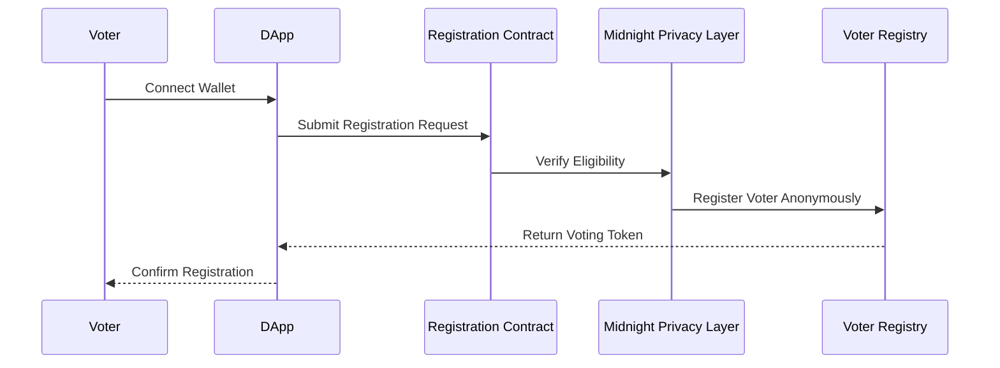
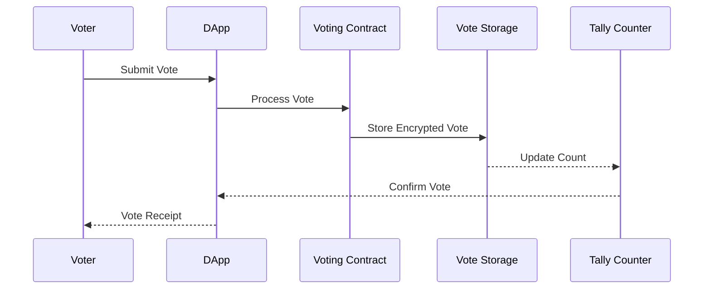
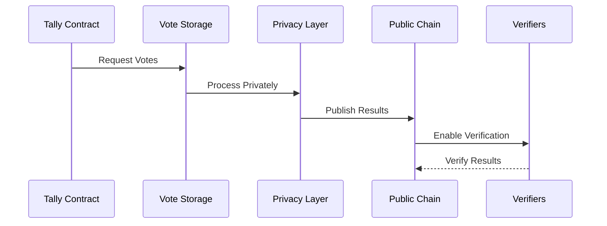

# Protocol Layouts and Interaction Specification

## 1. Voter Registration and Anonymity

### 1.1 Registration Flow Architecture


### 1.2 Registration State Management
```aiken
type RegistrationState {
    // Active registrations
    active_registrations: EncryptedMap<VoterId, RegistrationStatus>,
    
    // Registration timeframes
    registration_period: TimeFrame,
    
    // Eligibility criteria
    eligibility_rules: EligibilityCriteria,
}

type RegistrationStatus {
    // Registration state (pending/approved/rejected)
    status: Status,
    
    // Timestamp of registration
    timestamp: Timestamp,
    
    // Voting token if approved
    voting_token: Option<VotingToken>,
}
```

### 1.3 Registration Protocol Interactions
```aiken
fn process_registration(
    registration: RegistrationRequest,
    state: RegistrationState,
) -> Result<RegistrationState, RegistrationError> {
    // 1. Validate registration period
    verify_registration_period(state.registration_period)?;
    
    // 2. Check eligibility
    verify_eligibility(registration, state.eligibility_rules)?;
    
    // 3. Generate voting token
    let token = generate_voting_token(registration)?;
    
    // 4. Update state
    update_registration_state(state, registration, token)
}
```

## 2. Voting Process

### 2.1 Vote Casting Architecture


### 2.2 Vote Processing States
```aiken
type VotingState {
    // Active voting session
    active_session: VotingSession,
    
    // Vote storage
    votes: EncryptedVoteStorage,
    
    // Running tally
    tally: EncryptedTally,
}

type VotingSession {
    // Session parameters
    params: VotingParameters,
    
    // Session timeframe
    timeframe: TimeFrame,
    
    // Session status
    status: SessionStatus,
}
```

### 2.3 Vote Processing Protocol
```aiken
fn process_vote(
    vote: EncryptedVote,
    token: VotingToken,
    state: VotingState,
) -> Result<VotingState, VoteError> {
    // 1. Validate voting session
    verify_voting_session(state.active_session)?;
    
    // 2. Verify voting token
    verify_token(token)?;
    
    // 3. Process and store vote
    store_vote(vote, state.votes)?;
    
    // 4. Update tally
    update_tally(state.tally, vote)
}
```

## 3. Vote Tallying and Verification

### 3.1 Tallying Architecture


### 3.2 Tally Management
```aiken
type TallyState {
    // Current tally
    current_tally: EncryptedTally,
    
    // Verification proofs
    proofs: TallyProofs,
    
    // Publication status
    publication: PublicationStatus,
}

type TallyProofs {
    // Correctness proof
    correctness: CorrectnessProof,
    
    // Inclusion proofs
    inclusion: Vec<InclusionProof>,
    
    // Zero-knowledge proofs
    zk_proofs: Vec<ZkProof>,
}
```

### 3.3 Verification Protocol
```aiken
fn verify_tally(
    tally: TallyState,
    verifiers: Vec<Verifier>,
) -> Result<VerificationResult, VerificationError> {
    // 1. Verify correctness proof
    verify_correctness(tally.proofs.correctness)?;
    
    // 2. Verify inclusion proofs
    verify_inclusions(tally.proofs.inclusion)?;
    
    // 3. Verify zero-knowledge proofs
    verify_zk_proofs(tally.proofs.zk_proofs)?;
    
    // 4. Collect verifier signatures
    collect_verifier_signatures(verifiers)
}
```

## 4. System Integration

### 4.1 Cross-Component Communication
```aiken
type SystemState {
    // Registration state
    registration: RegistrationState,
    
    // Voting state
    voting: VotingState,
    
    // Tally state
    tally: TallyState,
}

fn update_system_state(
    current_state: SystemState,
    event: SystemEvent,
) -> Result<SystemState, StateError> {
    match event {
        RegistrationEvent(e) => handle_registration_event(current_state, e),
        VotingEvent(e) => handle_voting_event(current_state, e),
        TallyEvent(e) => handle_tally_event(current_state, e),
    }
}
```

### 4.2 State Transitions
```aiken
type StateTransition {
    // Previous state
    from_state: SystemState,
    
    // Next state
    to_state: SystemState,
    
    // Transition proof
    proof: TransitionProof,
}

fn validate_transition(
    transition: StateTransition,
) -> Result<ValidTransition, TransitionError> {
    // 1. Verify state consistency
    verify_state_consistency(transition.from_state, transition.to_state)?;
    
    // 2. Validate transition rules
    validate_transition_rules(transition)?;
    
    // 3. Verify transition proof
    verify_transition_proof(transition.proof)
}
```

### 4.3 Error Handling
```aiken
type SystemError {
    // Error type
    error_type: ErrorType,
    
    // Error context
    context: ErrorContext,
    
    // Recovery action
    recovery: RecoveryAction,
}

fn handle_system_error(
    error: SystemError,
    state: SystemState,
) -> Result<SystemState, CriticalError> {
    match error.error_type {
        RegistrationError(e) => handle_registration_error(e, state),
        VotingError(e) => handle_voting_error(e, state),
        TallyError(e) => handle_tally_error(e, state),
        SystemError(e) => handle_critical_error(e, state),
    }
}
```
