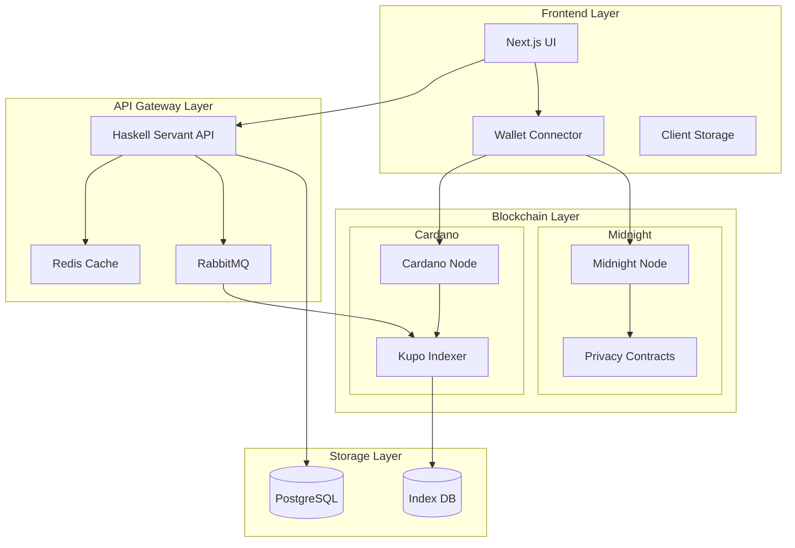

# System Architecture for Privacy-Preserving Voting System

## 1. Technical Stack Overview

### 1.1 Frontend Stack
```
- Framework: Next.js 14 (React)
- Styling: Tailwind CSS + shadcn/ui
- State Management: TanStack Query (React Query)
- Wallet Integration: Mesh.js (Cardano wallet connector)
- Build Tool: Vite
- Type Safety: TypeScript
```

### 1.2 Smart Contract Stack
```
- Language: Aiken
- Platform: Cardano + Midnight
- Testing: Aiken CLI test framework
- Development: Lucid (for contract interaction)
```

### 1.3 Backend Services
```
- API Framework: Haskell Servant
- Database: PostgreSQL
- Caching: Redis
- Queue System: RabbitMQ
- Indexer: Kupo (Cardano indexer)
```

### 1.4 Infrastructure
```
- Cloud: AWS
- CI/CD: GitHub Actions
- Monitoring: Grafana + Prometheus
- Logging: ELK Stack
- Container Orchestration: Kubernetes
```

## 2. System Components

### 2.1 Architecture Diagram


## 3. Component Interaction Details

### 3.1 Frontend Architecture

#### Next.js Application Structure
```typescript
src/
├── app/                    # Next.js 14 app directory
│   ├── api/               # API route handlers
│   ├── ballots/           # Ballot pages
│   ├── registration/      # Registration pages
│   └── voting/            # Voting pages
├── components/            # React components
│   ├── ui/               # UI components
│   ├── ballot/           # Ballot components
│   └── voting/           # Voting components
├── hooks/                # Custom React hooks
├── lib/                  # Utility functions
└── services/             # API services
```

#### Key Frontend Features
```typescript
// Wallet Integration
interface WalletService {
  connect(): Promise<WalletConnection>;
  sign(tx: Transaction): Promise<SignedTx>;
  submit(tx: SignedTx): Promise<TxHash>;
}

// State Management
interface VotingState {
  ballot: Ballot | null;
  registration: RegistrationStatus;
  vote: VoteStatus;
  proofs: ZkProofs;
}
```

### 3.2 Smart Contract Architecture

#### Contract Structure
```aiken
voting_protocol/
├── contracts/
│   ├── ballot.ak        # Ballot management
│   ├── registration.ak  # Voter registration
│   └── voting.ak        # Vote processing
├── lib/
│   ├── types.ak         # Common types
│   └── validators.ak    # Validation functions
└── tests/
    └── voting_test.ak   # Contract tests
```

#### Privacy Contract Integration
```aiken
// Integration with Midnight's privacy features
type PrivateVote {
  // Encrypted vote data
  encrypted_choice: ByteArray,
  // ZK proof of valid vote
  proof: ZkProof,
  // Nullifier to prevent double voting
  nullifier: ByteArray,
}

validator voting {
  fn vote(vote: PrivateVote) -> Bool {
    // Verify ZK proof
    verify_proof(vote.proof) &&
    // Check nullifier
    verify_nullifier(vote.nullifier) &&
    // Process encrypted vote
    process_private_vote(vote.encrypted_choice)
  }
}
```

### 3.3 Backend Services Architecture

#### API Service Structure
```haskell
-- API Routes
type VotingAPI = 
  "ballots" :> BallotAPI :<|>
  "registration" :> RegistrationAPI :<|>
  "voting" :> VotingAPI :<|>
  "verification" :> VerificationAPI

-- Service Layer
data VotingService = VotingService
  { ballotService :: BallotService
  , registrationService :: RegistrationService
  , votingService :: VotingService
  , verificationService :: VerificationService
  }
```

#### Database Schema
```sql
-- Core tables
CREATE TABLE ballots (
  id UUID PRIMARY KEY,
  title TEXT NOT NULL,
  description TEXT,
  start_time TIMESTAMP NOT NULL,
  end_time TIMESTAMP NOT NULL,
  status BALLOT_STATUS NOT NULL
);

CREATE TABLE registrations (
  id UUID PRIMARY KEY,
  ballot_id UUID REFERENCES ballots(id),
  commitment BYTEA NOT NULL,
  nullifier BYTEA NOT NULL,
  created_at TIMESTAMP NOT NULL
);

CREATE TABLE votes (
  id UUID PRIMARY KEY,
  ballot_id UUID REFERENCES ballots(id),
  encrypted_vote BYTEA NOT NULL,
  proof BYTEA NOT NULL,
  created_at TIMESTAMP NOT NULL
);
```

## 4. Security and Privacy Considerations

### 4.1 Privacy Features
```typescript
interface PrivacyProtocol {
  // ZK proof generation
  generateProof(input: VoteInput): Promise<ZkProof>;
  
  // Vote encryption
  encryptVote(vote: Vote): Promise<EncryptedVote>;
  
  // Anonymous credential generation
  generateCredential(registration: Registration): Promise<Credential>;
}
```

### 4.2 Security Measures
```typescript
interface SecurityProtocol {
  // Transaction signing
  signTransaction(tx: Transaction): Promise<SignedTransaction>;
  
  // Proof verification
  verifyProof(proof: ZkProof): Promise<boolean>;
  
  // Nullifier checking
  checkNullifier(nullifier: Nullifier): Promise<boolean>;
}
```

## 5. Development and Deployment Pipeline

### 5.1 Development Workflow
```yaml
development:
  local:
    - Next.js dev server
    - Local Cardano node
    - Local Midnight node
    - Docker compose for services
  
  testing:
    - Jest for frontend
    - Aiken test framework for contracts
    - Integration tests with TestContainers
    
  staging:
    - Cardano testnet
    - Midnight testnet
    - Staging API cluster
```

### 5.2 Deployment Configuration
```yaml
deployment:
  kubernetes:
    - Frontend deployment
    - API service deployment
    - Database statefulset
    - Redis cluster
    - RabbitMQ cluster
  
  monitoring:
    - Grafana dashboards
    - Prometheus metrics
    - ELK log aggregation
    
  scaling:
    - Horizontal pod autoscaling
    - Database read replicas
    - Cache cluster scaling
```

Would you like me to:
1. Elaborate on any specific component?
2. Provide more detailed technical specifications?
3. Add more security considerations?
4. Include additional infrastructure details?
5. Create specific component implementation examples?

The architecture is designed to be:
- Scalable
- Maintainable
- Secure
- Privacy-preserving
- Developer-friendly

Let me know which aspects you'd like to explore further!